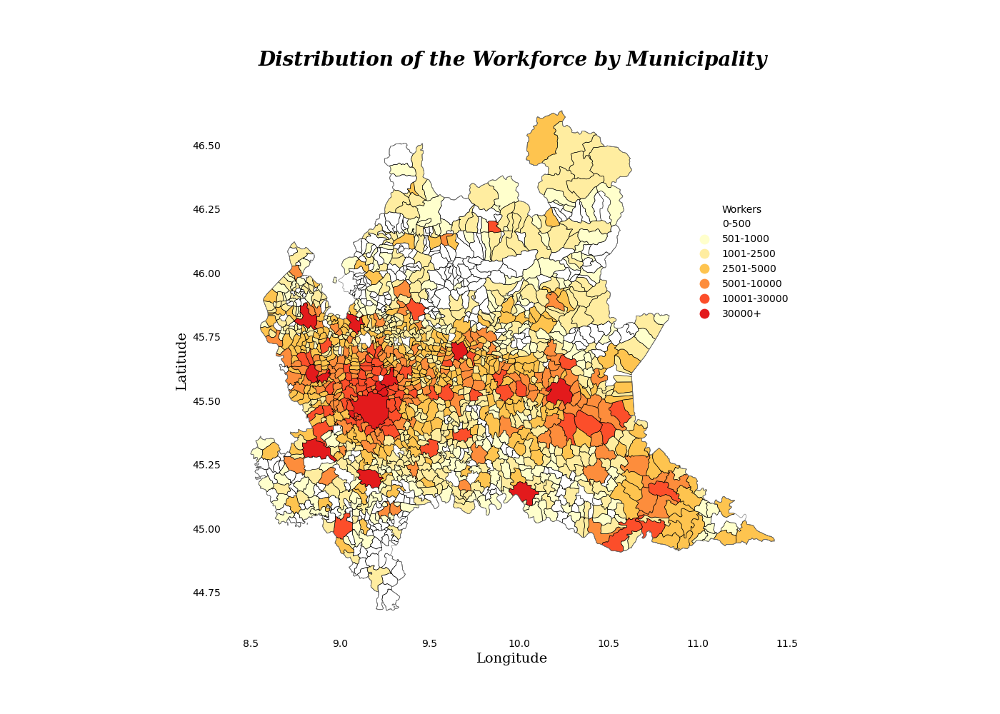
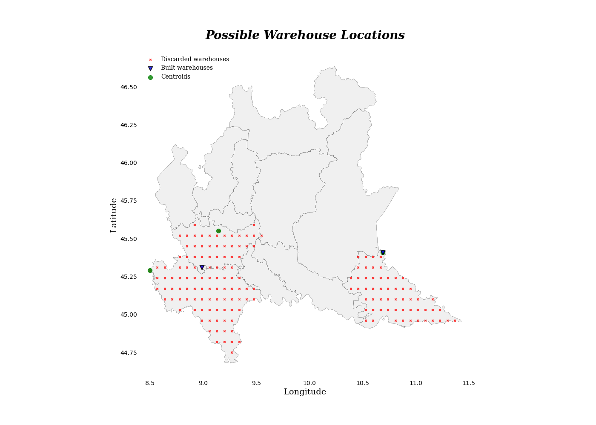
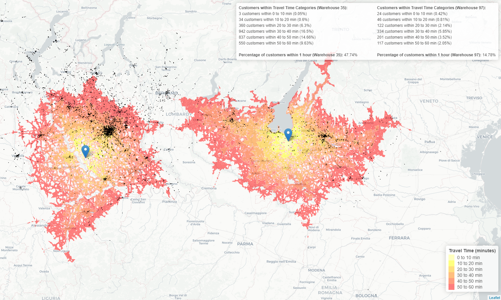

# Data Driven Warehousing
This project is dedicated to the data-driven optimization of warehouse locations. This repository aims to determine the most efficient placement of one or more warehouses, ensuring minimal costs.

## Table of Contents

- [Introduction](#introduction)
- [Objective](#objective)
- [Methodology](#methodology)
  - [1. Dataset and Data Cleaning](#1-dataset-and-data-cleaning)
  - [2. Exploratory Analysis](#2-exploratory-analysis)
  - [3. Clustering](#3-clustering)
  - [4. Additional Datasets](#4-additional-datasets)
  - [5. Optimization](#5-optimization)
- [Results](#results)
- [Future Directions](#future-directions)

## Introduction

OptimalWarehousing is designed to assist in the strategic location selection of logistic hubs, utilizing a data-driven approach. This project integrates various datasets and employs advanced optimization techniques to provide actionable insights for warehouse location decisions.

## Objective

The primary objective is to identify optimal locations in the Lombardy region for one or more logistic hubs. This involves using a data-driven strategy to balance various factors such as costs, geographic distribution, and logistical efficiency.

## Methodology

### 1. Dataset and Data Cleaning

We utilized a dataset containing:
- Customer codes
- Customer locations
- Provinces
- Geographic coordinates
- Order frequency over the last year

Data discrepancies between city/province and geographic coordinates were resolved using verified geographic data. Missing data were imputed based on ISTAT statistics.

### 2. Exploratory Analysis

Exploratory data analysis was performed to identify patterns and insights within the dataset. Key findings were used to guide the clustering and optimization stages.

### 3. Clustering

Clustering was performed in three steps:
1. **Initial Elbow Method Analysis**: To determine the optimal number of clusters.
  
2. **Original Clustering**: Based on initial analysis.
   
3. **Modified Clustering**: Adjustments were made to refine cluster centroids.
   

### 4. Additional Datasets

To enrich the analysis, additional datasets were utilized:
- **Logistic Enterprises**: Open Data from Regione Lombardia.
  
- **Labor Availability**: Population data from ISTAT.
  
- **Real Estate Values**: Data from Immobiliare.it.

### 5. Optimization

The optimization process involved:
- **Initial Clusters**: 3 clusters (Ponti sul Mincio, Palestro, Bollate).
- **Simulation**: 159 points were simulated across various provinces.
- **Decision Variables**: Fixed costs, average price per square meter by province, variable costs, distance and cost matrices, proximity to logistic enterprises, labor availability.

Optimization resulted in the selection of two warehouse locations:
- **Warehouse 1**: Casorate Primo, Pavia.
- **Warehouse 2**: Ponti sul Mincio, Mantova.

## Results

The optimization process identified two strategic locations for logistic hubs, covering approximately 63% of the customer base within a one-hour reach. These locations balance fixed and variable costs, labor availability, and proximity to logistic enterprises.

## Future Directions

Future improvements could include:
- Using road distances instead of straight-line distances.
- Incorporating rental costs as a variable.
- Considering other transportation modes besides highways.
